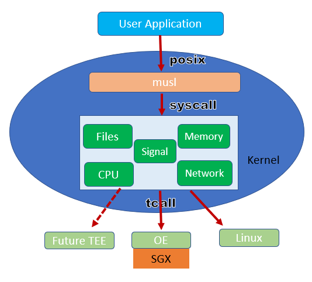

# Open LibOS

**Open LibOS** is a set of tools for running user applications in a trusted
execution environment (TEE). The current release supports **Intel &reg; SGX**
while other TEEs may be supported in future releases.

## Goals

- Protect user data throughout its lifecyle (at rest, in flight, in use).
- Lift and shift applications, either native or containerized, into TEEs with
  little or no modification.
- Allow users to minimize, control and inspect the makeup of the trusted computing
  base (TCB).
- Simplify retargeting to different TEEs through a plugin architecture.
- Publish under a non-restrictive open-source license (MIT).

## Architecture

**Open LibOS** consists of a C-runtime (CRT) based on
[MUSL](https://www.musl-libc.org/), a minimalist
kernel, and a target agnostic kernel-target interface (TCALL).

The minimalist kernel of Open LibOS manages essential computing resources
inside the TEE, such as CPU/threads, memory, files, networks, etc. It handles
most of the syscalls that a normal operating system would handle (with limits).
and certain operations are delegated to the target.



# Install or build

Binary downloads of the Open LibOS releases can be found on the Releases page
(coming).

Open LibOS can be built on an Ubuntu 18.04 machine with or without SGX
capability.

## Install the prerequisites

```
sudo apt update
sudo apt install -y git make
sudo apt install -y libmbedtls-dev
sudo apt install -y docker.io && sudo systemctl start docker && sudo systemctl enable docker
sudo chmod 666 /var/run/docker.sock
```

## Clone and build

```
git clone https://msazure.visualstudio.com/DefaultCollection/One/_git/OpenLibOS
cd OpenLibOS
make
```

Open LibOS can be used to run applications on a non-sgx Ubuntu 18.04 machine while
targeting for Linux. Obviously you need a sgx capable machine to target for SGX.
We recommend an [ACC VM](https://aka.ms/accgetstarted).

# Documents

- Key features of Open LibOS: [click here](doc/key-features.md)
- Getting started with a native program: [click here](doc/user-getting-started-c.md)
- Getting started with a containerized C++ program: [click here](doc/user-getting-started-docker-c++.md)
- Getting started with a containerized C# program: [click here](doc/user-getting-started-docker-c#.md)
- Getting started with a containerized Python program: [click here](doc/user-getting-started-docker-python.md)
- Open LibOS developer's jump start guide: [click here](doc/dev-jumpstart.md)
- Signing and packaging applications with Open LibOS: [click here](doc/sign-package.md)
- Release management: [click here](doc/releasing.md)

# Contributing to Open LibOS

You can contribute to Open LibOS in several ways:

- Contribute code. Please read developer's [jumpstart guide](doc/dev-jumpstart.md) first.
- File issues.
- Or simply provide feedbacks.

Please follow [Code of Conduct (coming)] while participating in the Open LibOS community.


